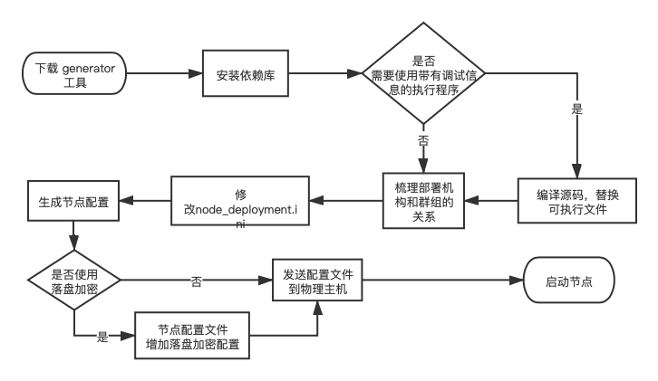
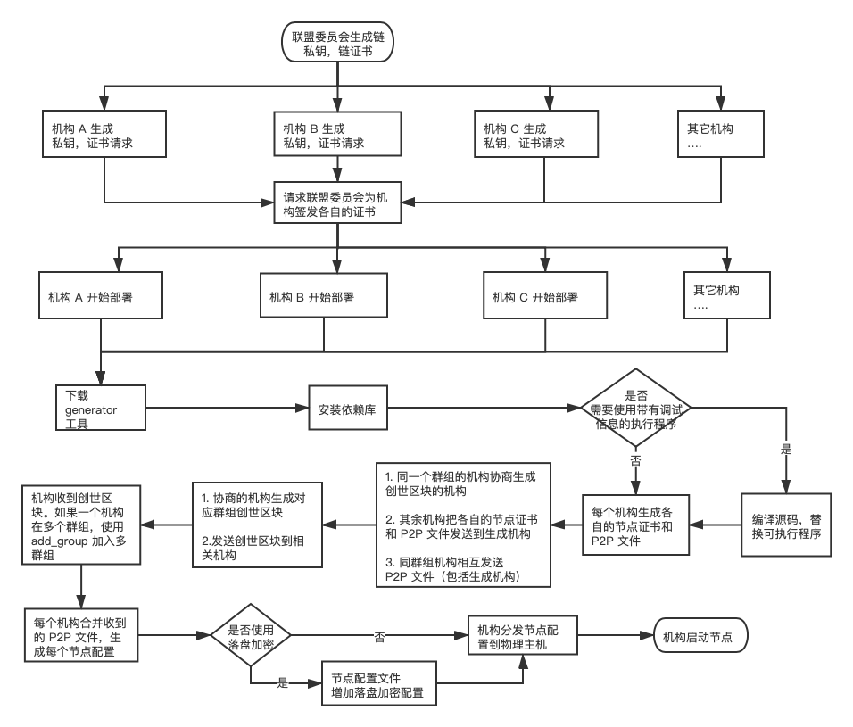

# 部署区块链

<span id="dev_env_deploy">

## 开发（体验）环境

开发环境部署是采用一键部署脚本 `build_chain.sh` 在单机上快速部署一条 4 节点的 FISCO-BCOS 联盟链，通过控制台（console）或可视化界面（WeBASE-Front）完成合约的编译，部署，调试和调用等操作。

主要操作步骤：
```Bash
# 下载一键脚本，添加执行权限
curl -LO https://raw.githubusercontent.com/FISCO-BCOS/FISCO-BCOS/master/tools/build_chain.sh

# 生成节点配置文件，如果使用国密，再加上一个 -g 参数
bash build_chain.sh -l "127.0.0.1:4" -p 30300,20200,8545

# 启动节点
bash nodes/127.0.0.1/start_all.sh
```

关于开发部署工具使用，请参考：[开发部署工具](https://fisco-bcos-documentation.readthedocs.io/zh_CN/latest/docs/manual/build_chain.html)

<span id="product_env_deploy" />

## 企业环境

对于企业部署，官方提供了**两种部署方式**和**三种部署工具**来满足现实场景中，多机构，多群组部署的需求。

* 部署方式

| 部署方式  | 特点  |
|---|---|
| 单机构部署  |  单机构部署所有节点（包括其他机构），适用于一个机构部署所有节点。<br />由于密钥统一由一个机构生成，有**泄漏风险** |
| 多机构对等部署  | 多机构对等部署，适用于多机构各自部署。每个机构各自部署自己的节点，<br />**机构私钥不出内网**，可以保证各机构密钥的安全  |


* 部署工具

| ‌部署工具 | ‌支持的部署方式 | 适用场景‌|启动方式 |备注   |
|-----------------|--------|-----|-----------------|----------------|
| ‌build\_chain\.sh | 单机构部署| 单机构部署所有节点 |‌脚本命令行 |开发部署工具|
| ‌WeBASE-Docker | 单机构部署 |单机构部署所有节点|Docker |使用 Dokcer 启动，<br />同时包含一个 WeBASE-Front 应用|
| ‌generator（推荐）| 单机构部署<br />**多机构对等部署**|多个独立机构联盟|‌脚本命令行 |**企业级部署**使用|

根据当前部署的场景和环境，选择合适的部署方式已经部署工具。

```eval_rst
.. important:: 

    - 在部署企业生产环境之前，一定要仔细阅读 `生产环境建议 <./deploy_advise.html#product_env_suggestion>`_ 部分，特别是 **备份** 说明，一定要做好配置文件的备份，降低故障恢复的成本和不能恢复的风险
    - WeBASE-Docker 部署方式，跟使用开发者部署工具大致相同。通过 `build_chain.sh` 生成节点配置文件。启动的时，通过手动执行 `docker run` 命令启动一个 Docker 容器
    - WeBASE-Docker 部署方式，在启动后，会同时启动一个 `WeBASE-Front` 应用，可以直接通过浏览器查看所有群组，节点的共识状态，块高，视图等信息
```


### 开发者工具部署 和 WeBASE-Docker

开发者工具部署 和 `WeBASE-Docker` 两种方式的部署方式大致相同，使用相同的方式生成节点的配置文件，仅仅是启动节点时，使用的启动命令不一样。

**主要操作步骤：**
* 安装依赖
    * 使用 `build_chain.sh`，安装 FISCO-BCOS 依赖
    * 使用 `WeBASE-Docker`，安装 Docker 环境
    
* 下载 `build_chain.sh` 一键脚本
* 新增机构和群组关系 `ip.conf` 配置文件
* (**可选**) 编译源码，获取二进制可执行程序
    * 如果需要使用带有调试信息的可执行程序，自行编译源码，获取可执行程序 `fisco-bcos`
    * 如果使用 WeBASE-Docker 容器方式启动节点，跳过
* 执行 `build_chain.sh` 脚本，使用 `-f ip.conf` 参数，生成节点配置
    * 如果使用自行编译的带调试信息的可执行程序，需要加上 `-e /path/to/excutable/fisco-bcos` 参数
* (**可选**) 是否使用落盘加密
* 拷贝生成的配置文件到相应的物理主机，注意使用 **云磁盘** 存放节点目录
* 登录每台物理主机，执行启动脚本，启动节点
    * 如果使用 WeBASE-Docker，手动使用 `docker run` 命令启动容器
* 验证部署结果，请参考：[验证部署结果](#verify_deploy_result)
* 备份生成的配置文件

详细的操作步骤，请参考：[开发者工具 和 WeBASE-Docker 部署详细操作](../appendix/deploy_for_env.html#build_chain_webase_docker_deploy)

```eval_rst
.. admonition:: 提示

     - 如果使用了 WeBASE-Docker 方式部署，由于 Dokcer 容器已经启动了一个 WeBASE-Front 应用，所以可以 **直接使用 WeBASE-Front 方式验证部署结果**
```

### 运维工具部署（generator）

FISCO-BCOS generator 是一个基于 Python 实现，为企业用户提供了部署、管理、监控多机构多群组联盟链的便捷工具。

generator 同时支持 **单机构部署** 和 **多机构对等部署** 两种方式。

关于 generator 工具的使用，请参考：[generator 运维部署工具使用](https://fisco-bcos-documentation.readthedocs.io/zh_CN/latest/docs/enterprise_tools/index.html)

根据部署文档，完成部署后，验证部署结果，请参考：[验证部署结果](#verify_deploy_result)。

#### 单机构部署
单机构部署是指在联盟链部署时，由协商的其中一个机构来生成所有的节点配置。




```eval_rst
.. admonition:: 落盘加密
     - 由于其它机构的私钥都是由部署机构来生成的，所以可能会存在私钥泄漏的风险。如果对于私钥的保密性要求很高的场景，建议使用 **多机构对等部署** 方式进行部署。
     - 如果使用落盘加密，请参考：[落盘加密](./deploy_choice.html#disk_data_encryption)；
```

关于 generator 部署工具在**单机构部署**时的操作，请参考：[单机构部署文档](https://fisco-bcos-documentation.readthedocs.io/zh_CN/latest/docs/enterprise_tools/tutorial_one_click.html#id1)

**ansible-for-fisco-bcos**

`ansible-for-fisco-bcos` 是 FISCO-BCOS 开源社区，开发者基于 `generator` 和 `ansible` 封装的一个企业级的快速部署工具。在部署 2 群组 3 机构 6 节点的环境，可以在 30 秒内（不包括下载时间）生成配置，极大简化了部署难度，避免了手工配置容易发生的错误。

关于 `ansible-for-fisco-bcos` 工具的使用，请参考：[ansible-for-fisco-bcos](https://github.com/newtouch-cloud/ansible-for-fisco-bcos)


#### 多机构对等部署


```eval_rst
.. admonition:: 提示

    - 每个机构的私钥和节点私钥不会发送到外部，保证安全；
    - 一条联盟链中只能用到一个根证书 `ca.crt`，由联盟委员会生成；
    - 一个群组只能有一个群组创世区块信息 `group.x.genesis`；
    - 一个机构属于多个群组时，使用 `add_group` 执行添加新群组；
    - 一个群组有 2 个以上的机构，需要将多个 `peers.txt` 需要合并到一个文件后再生成配置；
    - 生成的节点配置，只需要将配置推送到 IP 对应的物理主机即可；
    - 如果使用落盘加密，请参考：[落盘加密](#disk_data_encryption)；
```

关于 generator 部署工具在**多机构对等部署**时的操作，请参考：

- [使用企业级部署工具进行多机构对等部署 **（标密）** ](https://fisco-bcos-documentation.readthedocs.io/zh_CN/latest/docs/enterprise_tools/tutorial_detail_operation.html#id1)
- [使用企业级部署工具进行多机构对等部署 **（国密）** ](https://fisco-bcos-documentation.readthedocs.io/zh_CN/latest/docs/enterprise_tools/tutorial_detail_operation_gm.html#id1)


<span id="verify_deploy_result" />

## 验证部署结果


无论是部署开发环境部署，还是企业部署，都可以使用相同的方式来验证部署结果的。


验证部署结果主要有两种方式：

1. check_seal.sh 脚本
    * 执行 `check_seal.sh` 脚本，脚本会通过 JSON-RPC 请求获取节点的块高和 view，每分钟获取一次，跟上一次比对，如果相同则共识异常，如果不同，共识状态正常
2. WeBASE-Front
    * 部署 WeBASE-Front 应用，通过 Web 页面来查询部署结果

```eval_rst
.. admonition:: 提示

     - 如果使用了 WeBASE-Docker 部署方式，由于 Docker 镜像自带了 WeBASE-Front 镜像，就可以通过浏览器通过节点列表页面直接验证
```


### check_seal.sh 脚本验证
使用脚本验证部署节点的共识状态，详细的脚本文件和使用方法，请参考：[检查节点是否共识脚本](../appendix/tools.html#check_seal_shell)


### 可视化 WeBASE-Front 验证
可视化验证，需要部署 WeBASE-Front 应用，通过页面来查看部署的结果，请参考：[部署 WeBASE-Front](https://webasedoc.readthedocs.io/zh_CN/latest/docs/WeBASE-Front/install.html)


## 问题排查
如果在部署和验证中，出现问题，可以通过官方问题 [问题排查](https://fisco-bcos-documentation.readthedocs.io/zh_CN/latest/docs/faq/index.html) 查找相应解决办法。