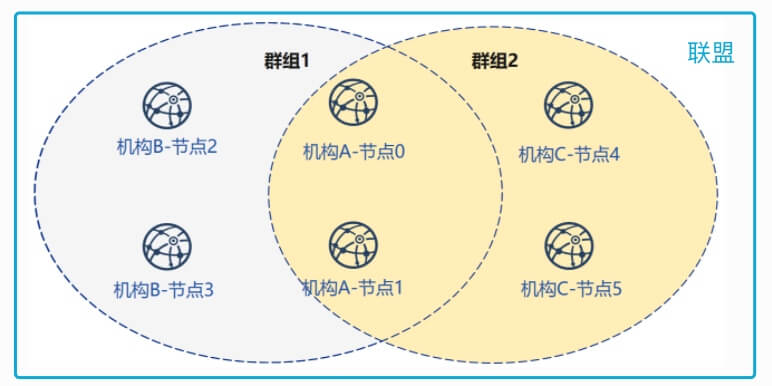
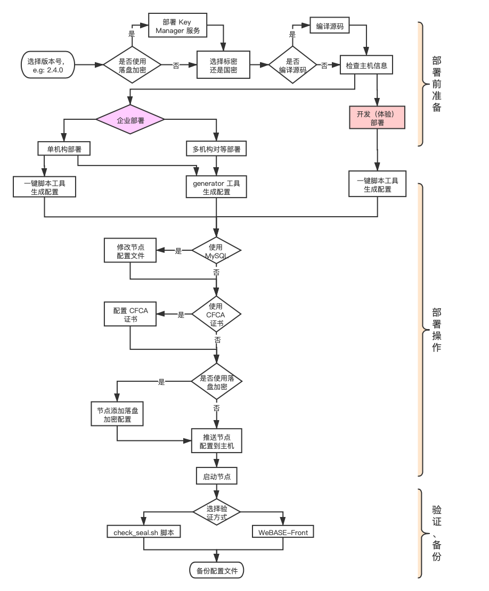

# 概览

区块链部署是指根据机构和群组的配置关系，使用部署工具，生成每个机构对应的节点配置文件，然后将生成的配置文件推送到单台或者多台主机，并启动节点服务，验证节点的共识状态，以及备份配置文件等一些列操作。

区块链部署是使用区块链服务的最重要的步骤，部署操作的结果将直接影响区块链服务的可用性。

## 基本概念
* **联盟**
   * 指参与一个基于区块链的业务协作或业务交易网络的所有组织的集合，一个联盟一般由多个机构组成。
* **机构**
    * 指参与区块链业务网络的企业、政府机构、团体、组织等实体。
* **节点**
    * 区块链业务网络中的最小单位，可以是一个业务进程或者一台物理主机。
* **群组**
    * 由多个机构的节点组成。

联盟、机构、节点、群组之间的关系如图：

## 部署流程
部署的大概流程分为 **部署前准备**，**部署操作** 和 **验证 + 备份** 三个阶段，大致流程如图：

## 生产环境建议
如果只需要部署开发（体验）环境，可以直接跳转到 [开发（体验）环境部署](deploy.html#dev_env_deploy)。

由于生产环境的重要性，所以这一小节针对部署生产环境，**提供一些建议**，以此最大化的的保障生产环境的安全性和稳定性。

### 机构节点数量
基于节点容灾备份的考虑，建议每个机构至少部署 2 个共识节点，建议分布在不同的机器甚至网段上。例如：3 个机构间通过一条链互联，则至少应该部署 3 * 2 = 6 个区块链共识节点（此时，最大只能容忍 1 个节点出错）。

### 群组节点数量
由于群组是由多个机构的节点组成，并且每个群组独立运行各自的共识算法。所以，建议一个群组内所有机构加起来的共识节点数至少为 3 * n + 1（`n` 表示系统最大可容错的节点数目，为大于等于 1 的整数），建议 n 取值 1，2 即可。

### 备份
在部署区块链服务时，部署工具会为链，机构，主机节点生成大量的配置文件。有些配置文件，一旦丢失后，都是不可再次生成的（比如，私钥文件）。一旦出现文件丢失，恢复的难度很高，甚至可以说无法恢复，严重的甚至会导致整个链无法恢复。所以，对这些文件进行 **双备份** 就是极其重要的。

* **生成配置使用单独的机器**
    在部署时，建议使用单独的机器生成配置文件，然后再将配置文件同步到对应的物理主机，同时对生成的文件做至少**双备份**。

* **使用云磁盘**
    如果节点主机采用的是云主机，强烈建议每个节点将配置文件都放到云磁盘中，而不是主机磁盘，防止配置文件随主机销毁而丢失。

需要备份的文件列表，请参考：[备份](./backup.html)

