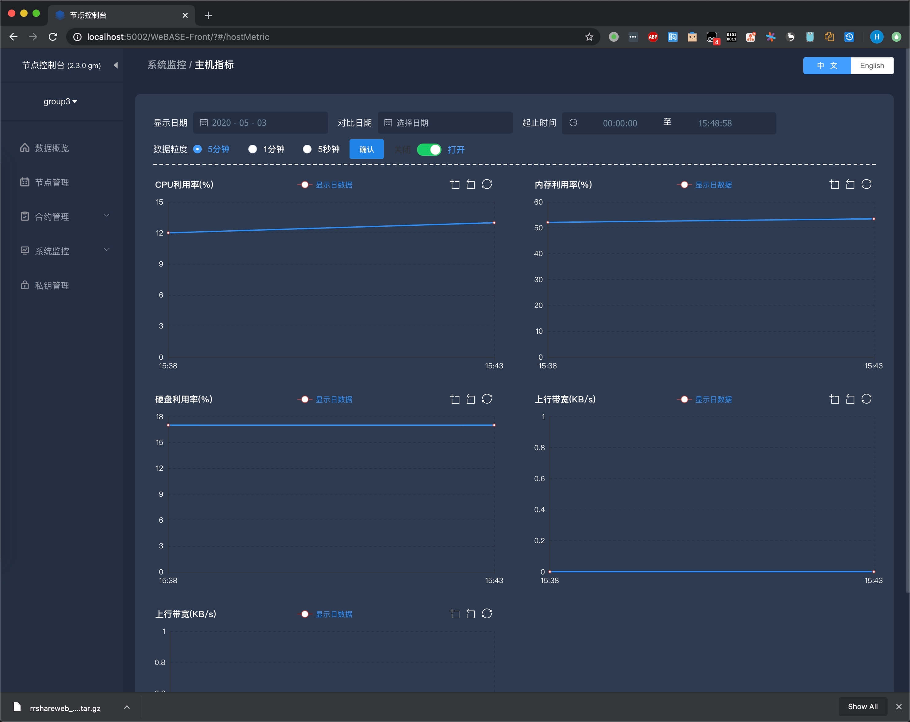
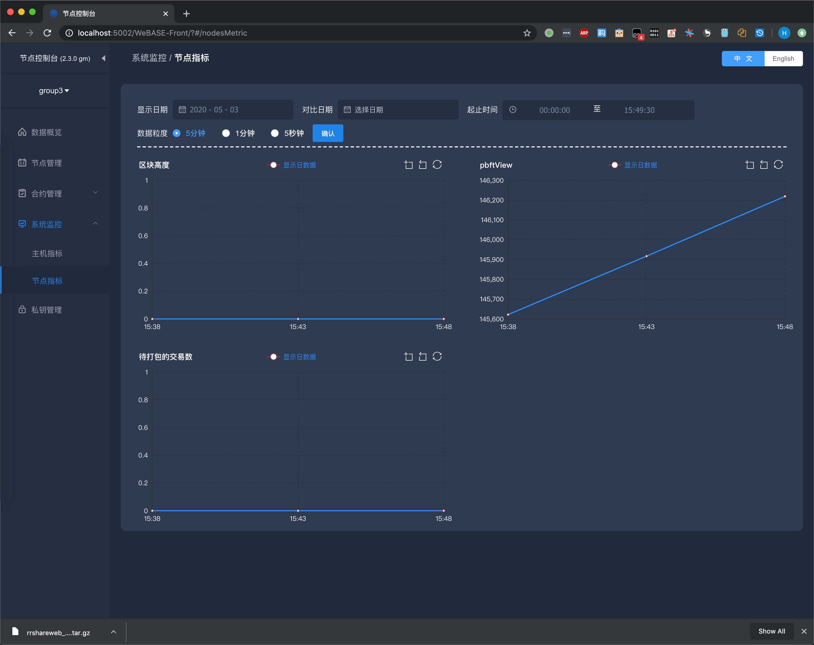

# 监控

监控是整个运维乃至整个产品生命周期中非常重要的一环，事前及时预警预防故障，事后提供详实的数据用于追查定位问题，通过发现、定位、解决问题，期望缩短异常出现的 MTTR （平均修复时间）。

如果没有监控，所有的基础运维，业务运维都是“瞎子”，毫无可靠性、安全性和稳定性，也就印证了运维界的老话：“**无监控、不运维**”。

区块链的核心监控指标：

| 监控指标  | 详细  | 推荐优先级  |
|---|---|---|
| 主机状态  | CPU，内存，磁盘 IO ，磁盘使用率，网络 | 云服务 > 平台监控 > WeBASE-Front |
| 节点存活  |fisco-bcos 进程 |monitor.sh |
| 共识状态  | 块高、view | monitor.sh > WeBASE-Front  |
| 错误日志  | 搜集所有的 error 和 warning 日志，判断网络连接状态  | monitor.sh|
| 告警  | 分析错误日志，发送告警信息到微信账号  | monitor.sh  |

```eval_rst
.. admonition:: 提示

     - 对于主机监控，如果使用云服务推荐优先使用云平台的监控，如果使用平台服务，可以使用平台监控，也可以选择 WeBASE-Front 服务
     - `monitor.sh` 脚本需要配合 `crontab` 一分钟执行一次
     - FISCO-BCOS 在 v2.x.x 以后的版本，对日志进行了优化，监控时只需要关注 `error` 和 `warning` 日志即可
```

## 日志说明
FISCO-BCOS 的日志，默认位于节点目录的 `log` 目录下，日志格式为：

`log_level|time|[g:group_id][module_name] content`

* log_level 
    * 日志级别。从小到大包括 trace、debug、info、warning、error、fatal
    * 最主要关注 error 和 warning 两种日志
* time
    * 表示日志打印时间
* [g:group_id]
    * 表示群组号
* [module_name]
    * 表示模块名，包括共识、同步、交易池、存储等
* content
    * 为具体日志内容

日志输出级别设定在 `config.ini` 文件配置。

```eval_rst
.. admonition:: 提示

     - 测试环境建议设置为 `trace` 或 `debug`
     - 生产环境建议设置为 `info` 级别，减少日志输出量（`trace` 和 `debug` 日志量较大），避免日志占用过多磁盘空间
```

关于日志说明，请参考：[日志格式](https://fisco-bcos-documentation.readthedocs.io/zh_CN/latest/docs/manual/log_description.html#id1)


## WeBASE-Front 监控示例
WeBASE-Front 的部署，请参考：[部署 WeBASE-Front](https://webasedoc.readthedocs.io/zh_CN/latest/docs/WeBASE-Front/install.html)。

```eval_rst
.. admonition:: 提示

     - 如果使用了 WeBASE-Docker 方式部署，由于 Dokcer 容器已经启动了一个 WeBASE-Front 应用，可以直接使用浏览器打开地址：http://[IP]:5002/WeBASE-Front/#/home 
```

* CPU，内存，磁盘使用率，网络




* 区块高度，pbftView，待打包交易数，如图：




## 监控脚本

FISCO-BCOS generator 生成的节点配置文件夹中提供了内置的监控脚本 `monitor.sh`，需要配置告警信息接受账号。再搭配 `crontab` 一分钟执行一次脚本。

脚本会自动解析节点日志，匹配一定的规则（比如某个 `error` 或者 `warning` 连续出现 5 次），自动发告警信息到配置的账号。

* `monitor.sh` 的功能：
    * 监控节点是否存活, 并且可以重新启动挂掉的节点；
    * 获取节点的**块高**和 `view` 信息, 判断节点**共识**是否正常；
    * 分析最近一分钟的节点日志打印, 收集日志关键错误打印信息, 准实时判断节点的状态；
    * 指定日志文件或者指定时间段, 分析节点的共识消息处理, 出块, 交易数量等信息, 判断节点的健康度；
    * 根据错误日志，发送告警信息到指定的微信账号；

```eval_rst
.. admonition:: 提示

     - 只有通过 FISCO-BCOS generator 生成的节点配置文件，才包含了 `monitor.sh` 脚本，`build_chain.sh` 生成的节点配置文件暂不包含。
     - `monitor.sh` 需要加入到 `crontab` 定时执行，推荐 **一分钟**
```

关于 monitor.sh 脚本监控的详细使用，请参考：[监控设计](https://fisco-bcos-documentation.readthedocs.io/zh_CN/latest/docs/enterprise_tools/operation.html#id6)


### 常见告警信息
* `OK! $config_ip:$config_port $node:[group:$group] is working properly: height $height view $view`
    * 节点正常启动, 群组`$group`共识正常并且共识模块正常工作；
    * **注意：区块链本身有一定的容错能力, 共识正确不代表整个链完全正常, 不排除有其他的节点异常；**

* ```ERROR! $config_ip:$config_port $node does not exist```
    * 节点`$node`进程不存在, 节点宕机, 此时会自动启动节点；
    * **注意：连续发生说明脚本无法正常启动进程,此时需要运维人员查看节点日志,确认节点无法正常启动的原因；**

* ```ERROR! Cannot connect to $config_ip:$config_port $node:[group:$group]```
    * 获取块高或者视图的`RPC`请求失败, 节点宕机获取节点群组`$group`RPC服务异常；

* ```ERROR! $config_ip:$config_port $node:[group:$group] is not working properly: height $height and view $view no change```
    * **群组共识异常，严重错误**；
    * 节点块高,视图与上次比较没有发生变化,  一般是因为区块链中有其他节点宕机或者网络直接p2p网络无法连通；


## 常见日志
* `Find disconnectedNode,disconnectedNodeSize=x`
    * 节点发现断连（已经建立过连接）；

* `disconnect error P2PSession,nodeID=xxxx`
    * 没有和节点建立连接；

* `TCP Connection refused by node,endpoint=10.107.105.137:30434,message=Connection refused`
    * 尝试重连节点失败；

* `ViewChangeWarning: not caused by omit empty block`
    * 共识异常日志，网络抖动、网络断连或配置出错(如同一个群组的创世块文件不一致)均有可能导致节点共识异常，PBFT共识节点会输出 `ViewChangeWarning `日志；


